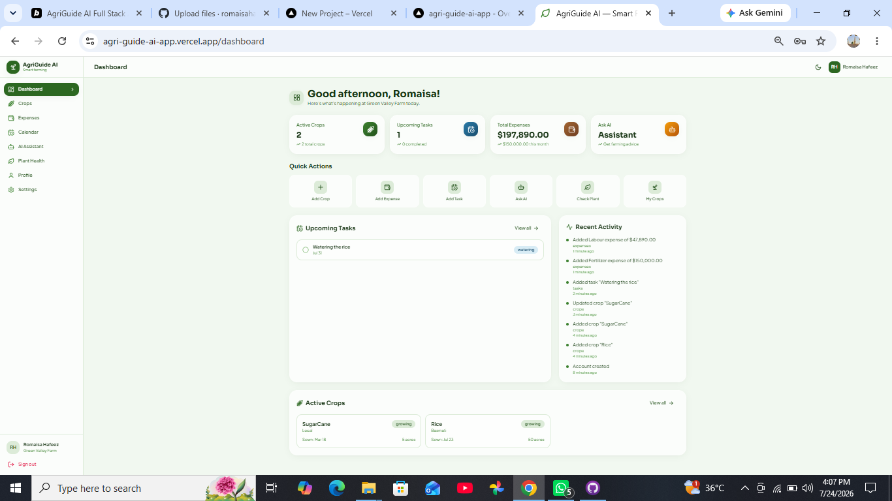
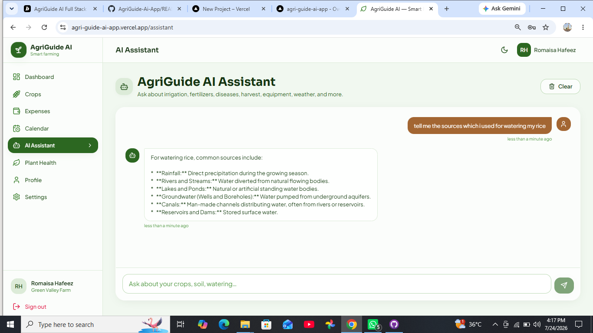

# 🌾 AgriGuide AI — Smart Farm Management Assistant

> A production-ready, AI-powered farm management web application that helps farmers track crops, manage expenses, schedule tasks, and get instant agricultural advice — all in one place.

**🔗 Live Demo:** https://agri-guide-ai-app.vercel.app/

---

## a. App Name, Purpose & Problem Solved

### App Name
**AgriGuide AI**

### What It Does
AgriGuide AI is an all-in-one digital companion for farmers and smallholder agricultural businesses. It combines practical farm management tools — crop tracking, expense logging, task scheduling, and an activity timeline — with two powerful AI features: a conversational farming assistant and an image-based plant disease checker. The app is fully responsive, works on mobile and desktop, supports light/dark themes, and includes secure user authentication with per-user data isolation.

### The Real Problem It Solves (and for whom)

Modern farming involves juggling dozens of decisions across crops, finances, schedules, and unpredictable threats like pests and disease. Most smallholder farmers and independent growers still rely on **notebooks, memory, and word-of-mouth** to manage their operations — leading to missed tasks, unclear costs, and delayed responses to crop problems. Professional farm-management software is often expensive, complex, and not built for the individual farmer.

**AgriGuide AI solves this by giving a single farmer:**

- **Visibility** — a live dashboard showing active crops, upcoming tasks, spending, and recent activity at a glance.
- **Organization** — structured records for crops, expenses, and tasks so nothing falls through the cracks.
- **Expert knowledge on demand** — a Gemini-powered assistant that answers questions about irrigation, fertilizers, diseases, harvesting, and more in plain, practical language.
- **Early disease detection** — a computer-vision plant health checker that analyzes a photo of a leaf or plant and flags possible diseases with suggested treatments — before a small problem becomes a lost harvest.

**Target users:** Independent farmers, smallholder growers, hobby farm operators, and agriculture students who need an accessible, affordable, and intelligent tool to run their farm more efficiently.

---

## b. Live Deployed URL

The application is deployed and publicly accessible on Vercel:

**🌐 https://agri-guide-ai-app.vercel.app/**

You can sign up for a free account and start using the app immediately. All data is stored per-user and persists across sessions.

---

## c. Complete Features List

### 🔐 Authentication & User Accounts
- Email and password sign-up and login
- Protected routes — unauthenticated users are redirected to the login page
- Per-user data isolation — each farmer only sees their own crops, expenses, tasks, and chat history
- Session persistence across browser reloads
- Password change support from the Settings page

### 📊 Dashboard
- Time-aware greeting ("Good morning / afternoon / evening") based on the user's local device time
- Live stat cards: Active Crops, Upcoming Tasks, Total Expenses (with current-month breakdown), and AI Assistant access
- Quick-action shortcuts to add crops, expenses, tasks, ask the AI, check plant health, and view crops
- Upcoming tasks panel with due-date labels and task-type badges
- Recent activity feed showing the user's latest actions
- Active crops preview with sowing date, area, and status

### 🌱 Crop Management
- Add, edit, and delete crops with fields for name, variety, sowing date, harvest date, area, area unit (acres/hectares), status, and notes
- Crop status lifecycle: Planning → Growing → Ready → Harvested
- Visual status badges and filtering
- Linked tasks — deleting a crop safely unlinks its associated tasks

### 💰 Expense Tracking
- Record expenses by category: Seeds, Fertilizer, Pesticides, Equipment, Labour, Other
- Add descriptions and expense dates
- Total and monthly expense summaries on the dashboard
- Edit and delete expense entries

### 📅 Calendar & Task Scheduling
- Create farm tasks with types: Watering, Fertilizer, Harvest, Other
- Link tasks to specific crops
- Set due dates and mark tasks as complete
- Upcoming-task reminders surfaced on the dashboard
- Add, toggle, and delete tasks

### 🤖 AI Farming Assistant (Chat)
- Conversational interface powered by Google Gemini 2.5 Flash
- Context-aware — sends the last 10 messages as conversation history for coherent multi-turn dialogue
- Covers irrigation, fertilizers, crop diseases, harvesting, equipment, weather, seeds, soil, pesticides, insects, farming techniques, crop varieties, government schemes, market prices, organic farming, and more
- Starter suggestion prompts for quick engagement
- Full chat history persisted per user; clear-conversation option

### 🍃 Plant Health Checker (AI Vision)
- Upload or drag-and-drop a plant photo (PNG/JPG)
- Gemini vision model analyzes the image and identifies whether the plant is healthy or diseased
- Provides a description of observed visual symptoms, a differential diagnosis (multiple possibilities), and practical treatment options
- Clear status indicators (healthy / warning / disease / unknown)
- Graceful error handling with retry guidance if the API is unreachable

### 👤 Profile
- Editable full name and farm name
- Avatar support
- Profile data reflected across the app (greeting, dashboard subtitle)

### ⚙️ Settings
- Toggle between light and dark theme
- Change account password
- Theme preference persisted per user

### 🎨 Design & UX
- Fully responsive layout — mobile, tablet, and desktop
- Light and dark mode with smooth transitions
- Forest/earth-themed color system suited to agriculture
- Glassmorphism cards, gradient accents, and micro-interactions (hover lifts, fade-ins)
- Accessible empty states with calls to action
- Confirmation dialogs for destructive actions
- Loading spinners and inline error states throughout

---

## d. AI Feature Detail & System Prompts

AgriGuide AI integrates **two distinct AI features**, both powered by **Google Gemini 2.5 Flash** via the `@google/generative-ai` SDK.

### Feature 1: AgriGuide AI Chat Assistant

A conversational assistant that answers farming questions. The model is given a strict system prompt that scopes it to agriculture topics and forces it to answer **only** the question asked — preventing topic drift and off-domain responses. The last 10 messages of conversation history are sent as context so the assistant can handle follow-up questions coherently.

**Exact system prompt used:**

```text
You are AgriGuide AI, an expert agriculture assistant for farmers.
Your goal is to understand the user's question accurately and answer exactly what the user is asking.
Rules:
- Always understand the user's intent before responding.
- Answer only the question that was asked.
- Never change the topic or assume the user is asking something else.
- If the user asks about irrigation, answer only about irrigation.
- If the user asks about fertilizers, answer only about fertilizers.
- If the user asks about crop diseases, answer only about crop diseases.
- If the user asks about harvesting, answer only about harvesting.
- If the user asks about farming equipment, answer only about farming equipment.
- If the user asks about weather, answer only about weather-related farming advice.
- If the user asks about seeds, soil, pesticides, insects, farming techniques, crop varieties, government schemes, market prices, organic farming, water sources, planting methods, or any other agriculture-related topic, provide a direct and relevant answer.
```

**How it works:** The system prompt is injected as the first user message in the `contents` array, followed by the formatted conversation history, and finally the new user question. The Gemini model generates a response that is saved to the user's chat history and displayed in the chat UI.

### Feature 2: Plant Health Checker (Vision Analysis)

An image-based disease detection tool. The user uploads a photo of a plant, which is converted to a base64-encoded inline data part and sent to Gemini alongside a detailed expert-prompt. The model acts as a plant pathologist and returns a structured analysis.

**Exact prompt used:**

```text
You are an expert plant pathologist. Closely analyze this plant image. 
1. Identify if there is any disease or if the plant is healthy.
2. Describe the specific visual symptoms you observe in the image.
3. List at least three distinct possibilities for the condition (differential diagnosis).
4. Provide at least three practical treatment options or next steps.
Keep the language clean, professional, and easy to understand for a farmer.
```

**How it works:** The image file is read via `FileReader` as a data URL, the base64 payload is extracted, and it is sent to the Gemini model using `generateContent([prompt, imagePart])`. The returned text is displayed in the analysis panel with appropriate status styling. If the API call fails, a graceful fallback message is shown with troubleshooting suggestions.

---

## e. Tools, Services & AI Models Used

| Category | Technology / Service |
| --- | --- |
| **Frontend Framework** | React 18 (with TypeScript) |
| **Build Tool** | Vite 5 |
| **Routing** | React Router DOM v6 |
| **Styling** | Tailwind CSS 3 (with PostCSS & Autoprefixer) |
| **Icons** | Lucide React |
| **Date Handling** | date-fns |
| **AI Model — Chat** | Google Gemini 2.5 Flash (text generation) |
| **AI Model — Vision** | Google Gemini 2.5 Flash (multimodal image understanding) |
| **AI SDK** | `@google/generative-ai` |
| **Authentication & Data Storage** | Browser localStorage with per-user namespacing and lightweight password hashing |
| **Deployment & Hosting** | Vercel (with SPA rewrite configuration) |
| **Version Control** | Git & GitHub |
| **Language** | TypeScript |

---

## f. Application Screenshots

> Replace the placeholder URLs below with your uploaded screenshot image links (e.g., hosted on GitHub, Imgur, or your own server).






---

## g. How to Run the Project Locally

Follow these steps to set up and run AgriGuide AI on your own machine.

### Prerequisites

- **Node.js** v18 or higher — [download here](https://nodejs.org/)
- **npm** (comes bundled with Node.js)
- A **Google Gemini API key** — get one free from [Google AI Studio](https://aistudio.google.com/app/apikey)

### Step 1 — Clone the repository

```bash
git clone https://github.com/<your-username>/agri-guide-ai-app.git
cd agri-guide-ai-app
```

### Step 2 — Install dependencies

```bash
npm install
```

### Step 3 — Configure environment variables

Create a `.env` file in the project root and add your Gemini API key:

```bash
# .env
VITE_GEMINI_API_KEY=your_google_gemini_api_key_here
```

> The Gemini API key must be prefixed with `VITE_` so Vite exposes it to the client-side application. Never commit your `.env` file — it is already listed in `.gitignore`.

### Step 4 — Start the development server

```bash
npm run dev
```

The app will be available at **http://localhost:5173** (Vite's default port).

### Step 5 — Build for production (optional)

To create an optimized production build:

```bash
npm run build
```

The built files will be output to the `dist/` directory. You can preview the production build locally with:

```bash
npm run preview
```

### Available npm Scripts

| Script | Description |
| --- | --- |
| `npm run dev` | Starts the Vite development server with hot reload |
| `npm run build` | Produces an optimized production build in `dist/` |
| `npm run preview` | Serves the production build locally for preview |
| `npm run lint` | Runs ESLint across the project |
| `npm run typecheck` | Runs the TypeScript compiler in type-check-only mode |

---

## License

This project was developed as a university final project. All rights reserved by the author.

---

**Built with React, TypeScript, Tailwind CSS, and Google Gemini AI.**
